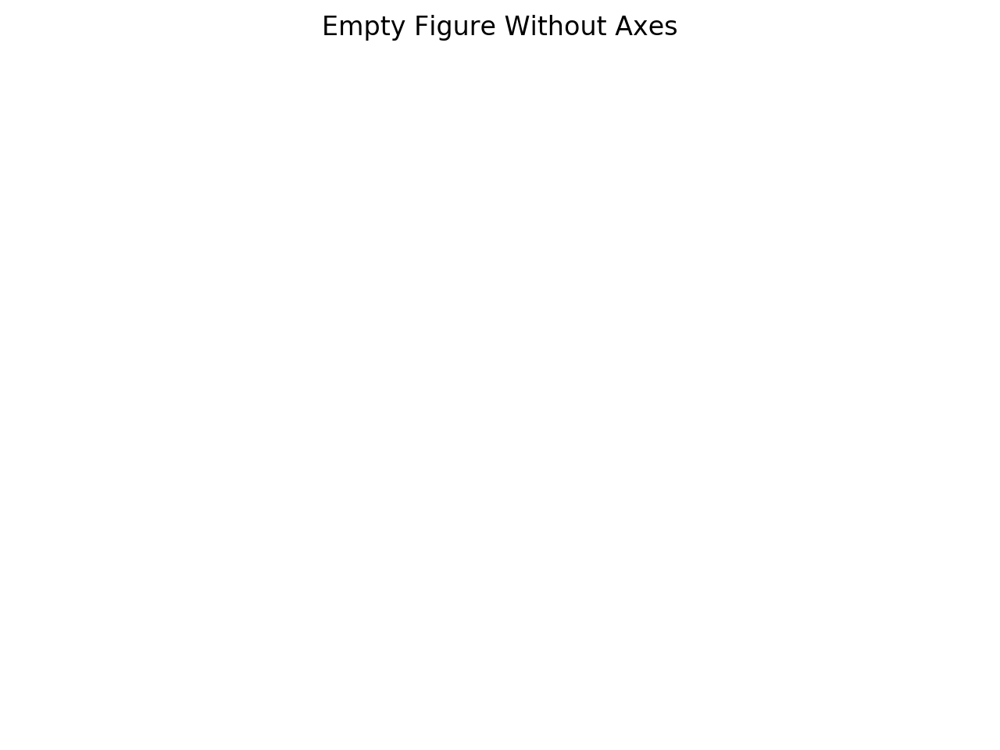

# Matplotlib

[Matplotlib][1] is one of the most mature visualization libraries
in Python. It allows us to quickly create figures when we are
first exploring our data and models, and allows us to have a
lot of control over our final figures for publications.

Like many mature software projects, it can be a bit daunting 
to work with at first. There are a couple ways to approach things 
with Matplotlib, through what is known as the state-machine interface
of [matplotlib.pyplot][2] and the object oriented approach. Depending 
on our needs, we might prefer one over the other. We will take 
a look at both of these approaches. 


## Key Components of a Figure

There are several components of a Matplotlib figure. Understanding 
how each of these fit together will give us better control over our
visualizations. This is important when we want to present our work 
in papers, but it will also help us debug things when the default 
settings for figures don't quite come out right.

### Figure

This is the entire figure object. It keeps track of all the figure's 
[Axes][3], legends, titles, and the [canvas][4] object. 

```python
import matplotlib.pyplot as plt

fig = plt.figure()
fig.suptitle('Empty Figure Without Axes')
plt.show()
```

<html>
<head>
<style>
img {
  display: block;
  margin-left: auto;
  margin-right: auto;
}
</style>
</head>
  <body>
    
  </body>
</html>

### Axes


[comment]: References

[1]: https://matplotlib.org/
[2]: https://matplotlib.org/3.1.1/api/_as_gen/matplotlib.pyplot.html#module-matplotlib.pyplot
[3]: https://matplotlib.org/api/axes_api.html#matplotlib.axes.Axes
[4]: https://matplotlib.org/3.2.2/api/backend_bases_api.html#matplotlib.backend_bases.FigureCanvasBase
[5]: img/ch02-visualization
