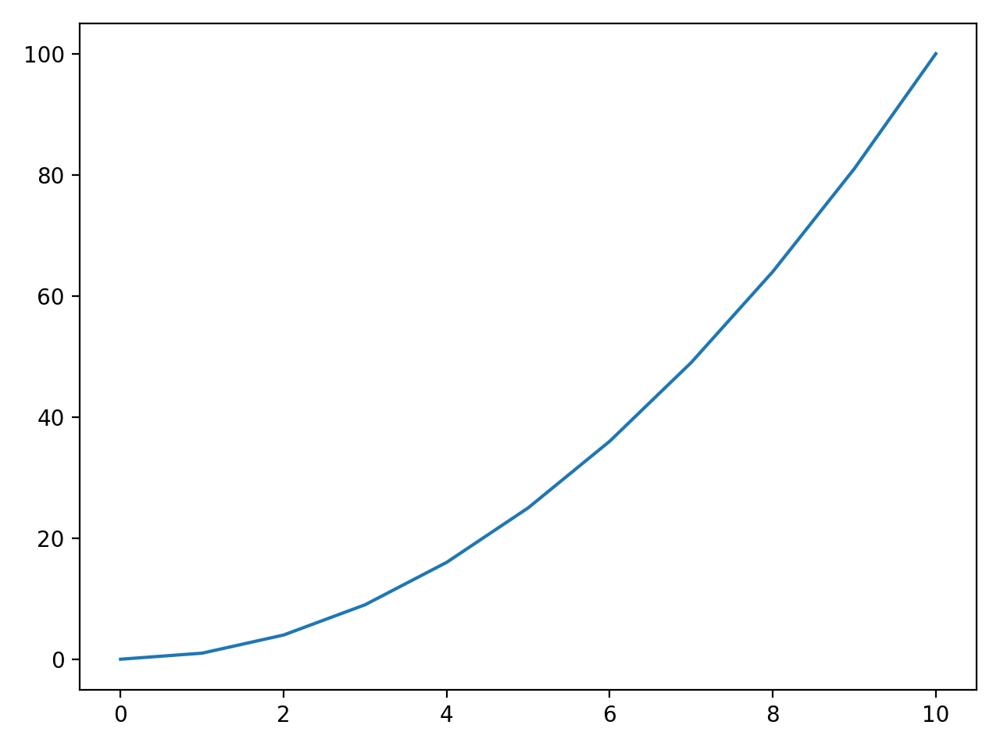
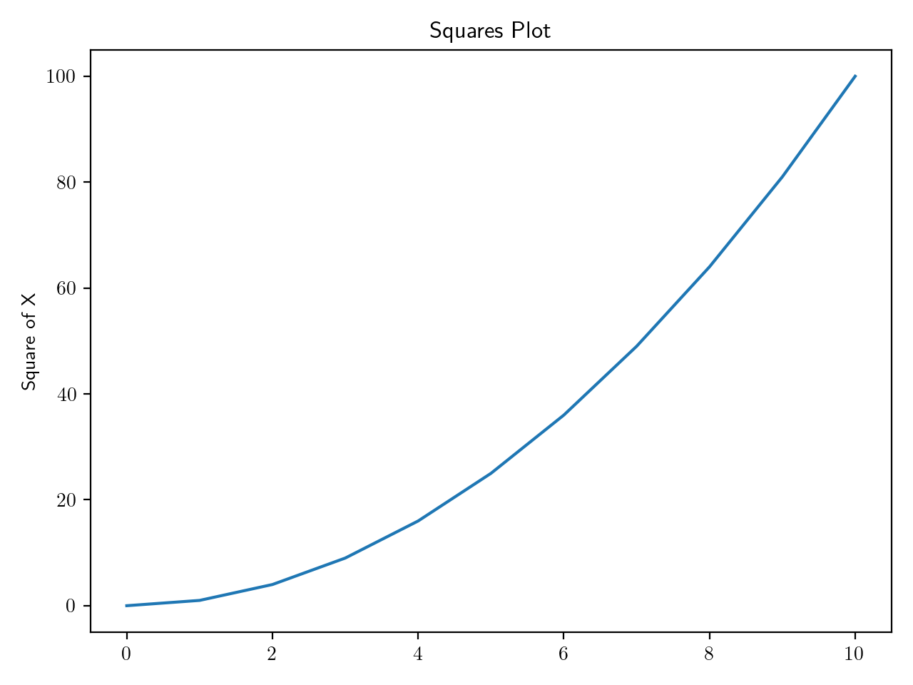

# Matplotlib's State-Machine Approach

Matplotlib's `matplotlib.pyplot` module is designed to feel like MATLAB.
Rather than explicitly creating figure objects, the `pyplot` module 
maintains state as soon as it is imported. If you come from a more 
object-oriented background, this may seem like a bit of magic. It can be
a bit difficult to know what Matplotlib is doing for you in the background,
but it does allow you to get up and running with fewer lines of code.

Let's take a look of a simple example, plotting a single curve:


```python
import matplotlib.pyplot as plt # immediately plt is keeping track of state

# first 10 squares
squares = [x**2 for x in range(11)]

plt.plot(squares)
plt.show()
```

<html>
<head>
<style>
img {
  display: block;
  margin-left: auto;
  margin-right: auto;
}

figcaption {
  color: white;
  padding: 2px;
  text-align: center;
}
</style>
</head>
  <figure>
    
    <figcaption>
      Fig.1 - A simple curve of the first 10 squares.
    </figcaption>
  </figure>
</html>

This is about as simple as a Matplotlib figure can get. Given `x`, 
a Python list of the first 10 squares, Matplotlib gives us a line
plot. The `pyplot` module is inferring a lot here. Notice that we did
not specify our x and y axes. We didn't even tell it Matplotlib that
we were looking to plot a curve here!

Also note that we never instantiated an object from the `pyplot` module.
Instead, we are calling the module directly. First, we feed our data
into `plt.plt(x)`, then we call `plt.show()` to render our figure. If we 
were to call `plt.show()` again without passing the data back into
`plt.plot()`, Matplotlib will not render the figure a second time. That 
is because Matploglib clears the state of our plot as soon as we call 
show`.

## Adding some Details

While pyplot can infer a lot of the details for us, we will need to
handle axis labels and titles ourselves.


```python
plt.plot(squares)
plt.title('Squares Plot')
plt.ylabel(r'$X^{2}$')
plt.xlabel('X')
plt.show()
```

<html>
<head>
<style>
img {
  display: block;
  margin-left: auto;
  margin-right: auto;
}

figcaption {
  color: white;
  padding: 2px;
  text-align: center;
}
</style>
</head>
  <figure>
    
    <figcaption>
      Fig.2 - Adding axis labels and a title to our figure.
    </figcaption>
  </figure>
</html>

[comment]: References

[1]: https://matplotlib.org/3.1.1/api/_as_gen/matplotlib.pyplot.html#module-matplotlib.pyplot
